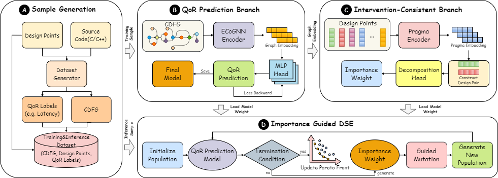

# ICQP-IGDSE: Importance-Guided HLS Design Space Exploration via Intervention-Consistent Modeling 

## Content

- [About the project](#jump1)
- [Project File Tree](#jump2)
- [Required environment](#jump3)

## <span id="jump1">About the project</span>

This project presents an end-to-end framework for high-level synthesis (HLS) design space exploration. It builds a training and inference dataset from source code, design points, and QoR labels, trains a graph-based QoR prediction model on CDFGs, and further learns pragma importance over pragma configurations. The predicted QoR and importance signals jointly drive an importance-guided DSE engine to search for Pareto-optimal design points efficiently.

**Framework overview:**



### Contribution

We propose **ICQP-IGDSE**, an automated framework featuring:

- **Dataset Construction:** Generates paired instances from C/C++ kernels, pragma design points, CDFGs, and QoR labels for model training and inference.
- **QoR Prediction Branch:** Employs an ECoGNN-based encoder to extract graph representations from CDFGs and predict QoR metrics through a dedicated prediction head.
- **Intervention-Consistent Branch:** Models pragma-level importance effects via design-pair construction and importance weighting, producing interpretable guidance for downstream exploration.
- **Importance-Guided DSE:** Integrates QoR prediction with importance weight to initialize populations, guide mutations, update the Pareto front, and terminate when exploration criteria are met.

## <span id="jump2">Project File Tree</span>
```
|-- ICQP-IGDSE
  |-- dse_database                 # databases, kernel sources, CDFGs, and dataset utilities
  |-- CoGNN                        # ECoGNN model components
  |   +-- action_gumbel_layer.py
  |   +-- layers.py
  |   +-- model_parse.py
  |-- save_models_and_data         # saved model weights
  |-- src                          # training, inference, and DSE
  |   +-- causal_data_utils.py
  |   +-- causal_model.py
  |   +-- config.py
  |   +-- config_ds.py
  |   +-- dse.py
  |   +-- main.py
  |   +-- model.py
  |   +-- nn_att.py
  |   +-- parallel_run_tool_dse.py
  |   +-- parameter.py
  |   +-- programl_data.py
  |   +-- result.py
  |   +-- saver.py
  |   +-- train.py
  |   +-- utils.py
```

## <span id="jump3">Required environment</span>
- os: Linux (recommended)
- python 3.9+
- torch 1.12+
- torch_geometric 2.2+
- transformers
- numpy
